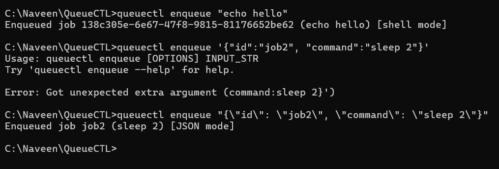
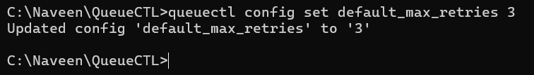
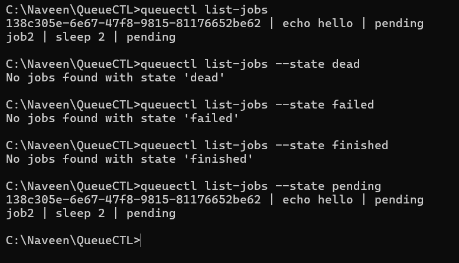
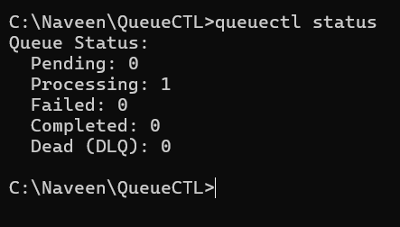
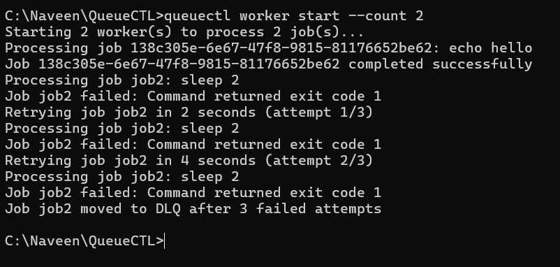
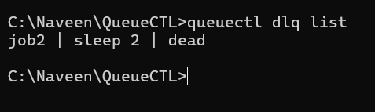
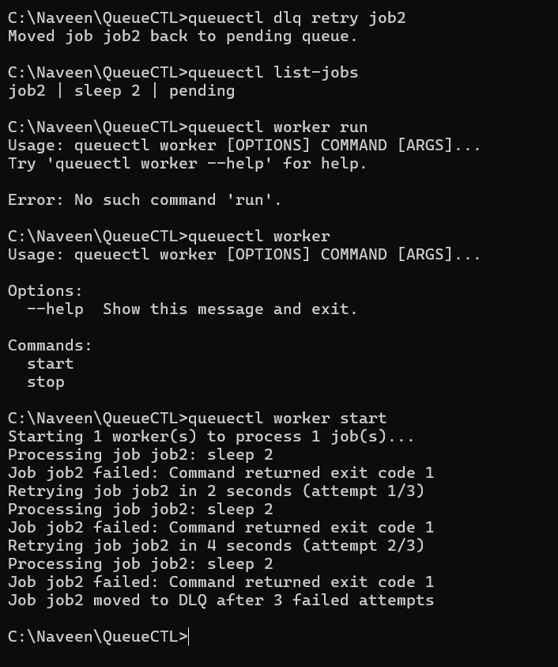

# QueueCTL

A Command Line Interface for handling system jobs, built for the Flam backend developer assignment.

# Setup

1. Clone or download this repository to your system (requires windows/macOS/linux, python 3.12, and any version of pip).

2. Navigate to the local copy of the repository and confirm that `job.py`, `storage.py`, `worker.py`,
   `cli.py`, `dlq.py`, `main.py`, `setup.py`, `config.json`, and `requirements.txt` are present.

3. Install the pyhon dependencies by running `pip install -r requirements.txt`.

4. Install queuectl as a tool by running the command `pip install -e .`.

5. Verify the installation by running `queuectl --help`. You should get the list of commands as the output, as well as the usage syntax

# Usage

Provided below are the commands that can be used, and their respective outputs:

1. `queuectl enqueue <job>`:
   

2. `queuectl conig <variable name> <value>`:
   

3. `queuectl list-jobs (OPTIONAL --state <state>)`:
   

4. `queuectl status`:
   

5. `queuectl worker (start/stop) (OPTIONAL --count <worker count>)`:
   

6. `queuectl dlq list`:
   

7. `queuectl dlq retry <job ID>`:
   
